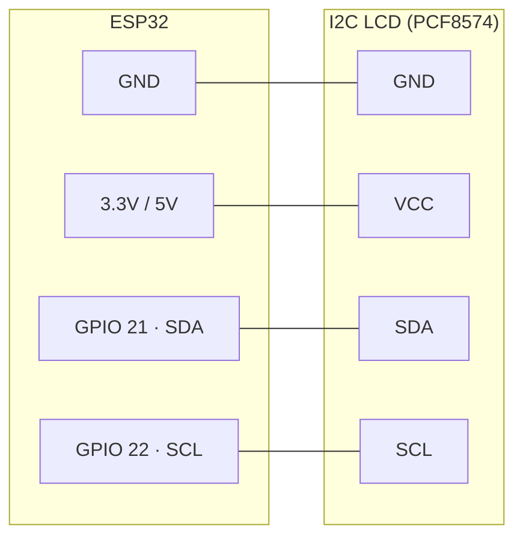

# ESP32 Hobby Projects

A collection of hobby projects and experiments with the ESP32, written in MicroPython.

---

## Projects

### 1. I2C LCD Clock

Wi‑Fi–connected clock that syncs time via NTP and displays the device IP and local date/time on a 2×16 I2C character LCD.

**Features**

- **Wi‑Fi connection** — Connects to a configured network and shows status on the LCD
- **NTP time sync** — Sets the RTC from the network (configurable UTC offset)
- **LCD display** — Shows IP address on line 1 and date/time (MM/DD HH:MM:SS) on line 2, updating every second
- **HD44780 + PCF8574** — Uses a standard I2C LCD backpack (e.g. common blue 2×16 modules)

**Hardware**

- **ESP32** (e.g. Wemos D1 Mini ESP32 or generic ESP32 dev board)
- **I2C LCD** — 2×16 character LCD with HD44780 controller and PCF8574 I2C backpack (address typically 0x27 or 0x20–0x27)

**Wiring**

| LCD (PCF8574) | ESP32  |
|---------------|--------|
| GND           | GND    |
| VCC           | 5V or 3.3V |
| SDA           | GPIO 21 |
| SCL           | GPIO 22 |

**Software:** MicroPython for ESP32 (with `network`, `ntptime`, `machine`, `utime`)

**Project structure**

| File               | Description |
|--------------------|-------------|
| `main.py`          | Entry point: connects Wi‑Fi, then loops showing IP and date/time on the LCD |
| `wifi.py`          | Wi‑Fi connection, NTP sync, I2C and LCD setup; exposes `lcd` and `connect_wifi()` |
| `machine_i2c_lcd.py` | I2C driver for HD44780 LCD via PCF8574 |
| `lcd_api.py`       | Low-level HD44780 LCD API (clear, cursor, putstr, etc.) |

**Configuration** — Edit `wifi.py` before flashing:

- **`SSID`** — Your Wi‑Fi network name  
- **`PASSWORD`** — Wi‑Fi password  
- **`UTC_OFFSET`** — Offset from UTC in seconds (e.g. `8 * 3600` for UTC+8)

I2C pins and LCD size are in `wifi.py`: `sda=Pin(21)`, `scl=Pin(22)`, 2 lines × 16 columns. PCF8574 address is auto-detected via `i2c.scan()[0]`.

**Usage**

1. Flash **MicroPython** onto your ESP32.
2. Copy all project files to the board (e.g. with `mpremote`, `ampy`, or Thonny).
3. Set **SSID**, **PASSWORD**, and **UTC_OFFSET** in `wifi.py`.
4. Power or reset the board. The device will connect to Wi‑Fi (LCD shows “WiFi: Connecting”), sync time via NTP, then show IP and date/time, updating every second.

**Extending:** You can add sensor code in `main.py` and display readings using `wifi.lcd` (e.g. `wifi.lcd.putstr(...)`, `wifi.lcd.move_to(...)`).

---

*More projects will be added as they’re built.*
